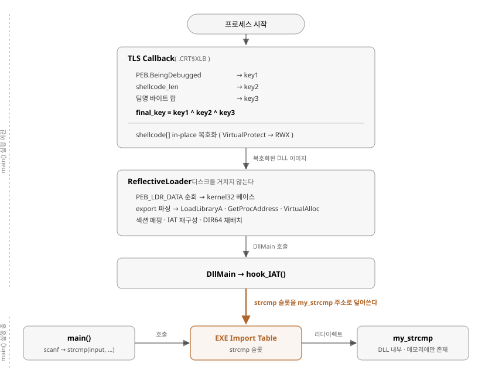
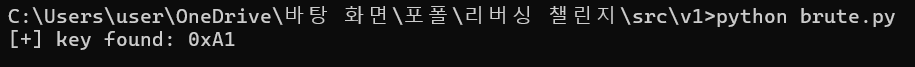
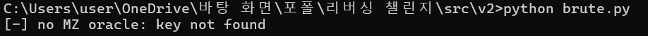
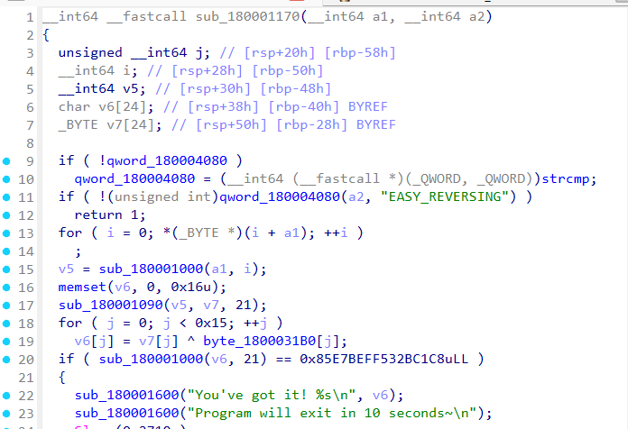
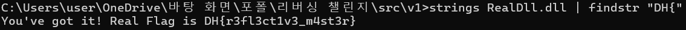
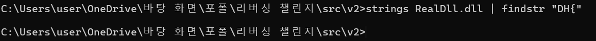
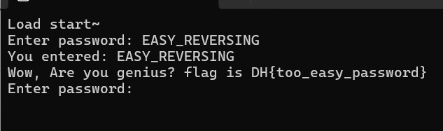
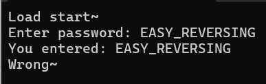
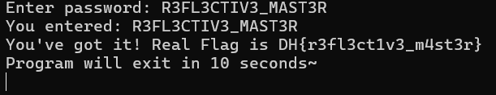
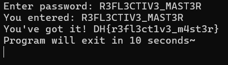

# 자작 리버싱 CTF 챌린지의 설계 결함 감사 및 개선 (v1 → v2)

> **한 줄 요약:** 직접 제작한 Windows x64 리버싱 챌린지를 **공격자 관점으로 재감사**하여 의도한 풀이 경로를 무의미하게 만드는 **설계 결함 5건을 도출**하고, 그중 **3건(REV-01 / REV-02 / REV-04)을 수정한 v2를 구현·검증**한 기록. 핵심 발견은 **무결성 확인을 위해 넣은 MZ 시그니처 검사가 XOR 키 전수조사의 정답 판별기(오라클)로 전락**했다는 점이다.
>
> **작업 범위:** 챌린지 설계·구현(TLS Callback · Reflective DLL Injection · IAT 후킹) · 자체 보안 감사 · 결함 수정 · 수정 전후 대조 검증
> **문서 원칙:** 각 주장을 <span class="lb lb-f">사실</span>(실행·관측) · <span class="lb lb-i">추론</span>(코드 해석) · <span class="lb lb-u">미검증</span>(추가 확인 필요)으로 구분한다.
> **포지셔닝(정직성):** 본 문서는 **신규 취약점 발견이 아니다.** 사용한 기법(Reflective DLL Injection · IAT 후킹 · TLS 콜백 안티디버깅)은 모두 널리 공개된 기법이며, 본 작업의 내용은 **그 기법들로 만든 자작 산출물을 스스로 공격해 설계 결함을 찾아내고 고친 과정**이다. v2로도 남는 한계는 §9에 그대로 명시했다.

---

## 핵심 역량 (Skills demonstrated)

| 영역 | 내용 |
|---|---|
| **Windows 내부구조** | PE 포맷(DOS/NT 헤더 · 섹션 · IAT · 베이스 재배치) · PEB 직접 접근(`__readgsqword(0x60)`) · `PEB_LDR_DATA` 모듈 리스트 순회 · TLS 콜백(`.CRT$XLB`) |
| **코드 주입 기법** | Reflective DLL Injection 자체 구현 — 섹션 매핑 · IAT 재구성 · `IMAGE_REL_BASED_DIR64` 재배치 · 엔트리포인트 호출 / IAT 후킹(`strcmp`) |
| **CRT 무의존 구현** | 임포트를 늘리지 않기 위해 `memcpy`·`memset`·대소문자 무시 비교(ANSI/wide)를 직접 구현 · API 주소를 export 테이블 파싱으로 직접 해석 |
| **정적 분석** | IDA Hex-Rays 디컴파일 · 문자열/상수 교차참조(xref)로 검증 루틴 역추적 · 수정 전후 슈도코드 대조 |
| **보안 설계 감사** | 제작자 관점 → 공격자 관점 전환 · **오라클 제거** 기준의 결함 분류 · 위협 모델 명시 · 수정 범위와 미해결 범위 분리 |
| **검증 프로세스** | 브루트포스 PoC 작성 · v1/v2 동일 조건 대조 · **보안 수정 후 정답 경로 회귀 검증**(기능 파괴 방지) |

---

## 1. 대상 및 환경 <span class="lb lb-f">사실</span>

| 항목 | 내용 |
|---|---|
| 대상 | 자작 Windows x64 리버싱 CTF 챌린지 (콘솔 실행 파일 1개) |
| 목표 | 입력한 비밀번호가 정답일 때만 플래그를 출력. 플래그·비밀번호를 정적 분석으로 쉽게 얻을 수 없게 한다. |
| 구현 | C / C++ (MSVC x64) · Python 3 (빌드 파이프라인) |
| 분석 도구 | IDA Pro (Hex-Rays) · `dumpbin` · 자작 브루트포스 스크립트 |
| 정답 / 플래그 | 비밀번호 `R3FL3CTIV3_MAST3R` → 플래그 `DH{r3fl3ct1v3_m4st3r}` |
| 미끼 | `EASY_REVERSING` → 가짜 플래그 `DH{too_easy_password}` |

---

## 2. v1 설계 — 다단 은닉 구조 <span class="lb lb-f">사실</span>

풀이자가 곧바로 플래그에 도달하지 못하도록, 실제 판정 로직을 실행 파일 본체에서 분리해 **암호화된 DLL** 안에 넣고, 그 DLL을 **디스크에 쓰지 않고** 메모리에서 직접 로드하도록 설계했다.

```
TLS Callback  (main 보다 먼저 실행)
  |
  +- PEB.BeingDebugged  --+
  +- shellcode_len       --+-->  XOR 키 3개 유도  -->  final_key
  +- 팀명 문자열 체크섬   --+
  |
  +- shellcode[] in-place 복호화   (VirtualProtect -> RWX)
  |
  +- ReflectiveLoader(shellcode)
       +- PEB_LDR_DATA 순회로 kernel32 베이스 확보
       +- export 테이블 파싱 -> LoadLibraryA / GetProcAddress / VirtualAlloc
       +- 섹션 매핑 · IAT 재구성 · DIR64 재배치
       +- DllMain 호출
            +- hook_IAT() : 본체 EXE 의 IAT 에서 strcmp -> my_strcmp 로 교체

main()
  +- scanf -> strcmp(input, ...)     <- 이미 my_strcmp 로 후킹된 상태
                                        정답이면 플래그 출력
```

안티디버깅은 별도 분기가 아니라 **키 유도에 섞어** 넣었다. 디버거가 붙으면 `PEB.BeingDebugged`가 1이 되어 `key1`이 0이 되고, 복호화 결과가 쓰레기가 되어 로드 자체가 실패한다. "디버깅을 감지하면 종료한다"가 아니라 **"디버깅 중이면 애초에 동작하지 않는다"**가 되도록 한 것이다. <span class="lb lb-i">추론</span>



---

## 3. 감사 방법론 — 제작자 관점에서 공격자 관점으로

구현을 끝낸 뒤 **"내가 풀이자라면 어디를 먼저 볼까"**를 기준으로 스스로를 공격했다. 판단 기준은 하나로 뒀다.

> **판단 기준:** 이 요소가 공격자에게 **"맞았는지 틀렸는지 알려주는 신호(오라클)"**를 주는가? 준다면, 그 신호의 존재만으로 의도한 풀이 경로는 우회된다.

이 관점으로 결함 5건을 도출하고 `REV-01`~`REV-05`로 번호를 붙여 관리했다. 각 항목은 *결함 / 공격 시나리오 / 수정 방안 / 수정 후 검증* 네 칸으로 기록했다.

---

## 4. 도출된 설계 결함 5건

| ID | 결함 | 공격자가 얻는 것 | 심각도 | v2 조치 |
|---|---|---|---|---|
| **REV-04** | 복호화 결과를 `MZ` 시그니처로 검증 — 이 코드가 XOR 키 전수조사의 정답 판별기로 동작 | 키 탐색 공간 256개를 **즉시 확정**. 챌린지 1단계 전체 무력화 | **높음** | **수정** |
| **REV-01** | 플래그가 `printf` 인자에 **평문 문자열**로 존재 | 비밀번호를 풀지 않고 `strings`만으로 플래그 획득 | **높음** | **수정** |
| **REV-02** | 미끼 비밀번호가 가짜 플래그를 출력 — 플래그 형식이 노출되고 오라클로 쓰일 수 있음 | 플래그 포맷 `DH{...}` 확인 · 미끼 경로를 정답 경로로 오인 | 중간 | **수정** |
| **REV-03** | 셸코드 복호화 키가 코드 무결성에 묶여 있지 않음 — 안티디버깅 분기를 패치하면 키가 복원됨 | `PEB.BeingDebugged` 패치 또는 `key1` 상수 패치로 안티디버깅 무력화 | 중간 | *미해결* |
| **REV-05** | 복호화 이후 DLL이 RWX 메모리에 평문으로 상주 | TLS 콜백 종료 후 어태치 → 메모리 덤프로 DLL 획득 | 중간 | *미해결* |

우선순위는 **심각도가 아니라 "의도한 풀이 경로를 얼마나 무의미하게 만드는가"**로 정했다. REV-04를 1순위로 둔 이유는 §5에 있다.

---

## 5. REV-04 — 무결성 검사가 브루트포스 오라클이 된 경위 <span class="lb lb-f">사실</span>

### 5-1. 문제

v1의 TLS 콜백은 복호화가 제대로 됐는지 확인하려고 아래 검사를 두고 있었다.

```c
if (shellcode[0] == 0x4D && shellcode[1] == 0x5A) {   // 'M','Z'
    sub_140001000(shellcode);        // Reflective Loader
} else {
    return;
}
```

의도는 무결성 확인이었다. 그런데 이 검사는 **공격자에게 정확히 같은 기능을 제공한다.** XOR 키가 1바이트이므로 후보는 256개뿐이고, "복호화 결과가 `MZ`로 시작하는가"는 그 256개 중 정답 하나를 고르는 완전한 판별식이다. 키 유도 로직(안티디버깅 · 파일 크기 · 팀명 체크섬)을 **전혀 분석하지 않아도 된다.**

```python
# brute.py — 판별 근거가 있으면 키 유도 로직은 분석할 필요가 없다
data = open("shellcode.bin", "rb").read()
for key in range(256):
    dec = bytes(b ^ key for b in data)
    if dec[0:2] == b"MZ":
        print(f"[+] key found: 0x{key:02X}")
        break
else:
    print("[-] no MZ oracle: key not found")
```

> 공들여 설계한 3중 키 유도 구조가, 무결성 검사 두 줄 때문에 **분석 대상에서 통째로 제외**됐다. 방어 기제를 추가했는데 난이도가 내려간 사례다.

### 5-2. 수정

판별 근거가 되는 상수를 암호화 **전에** 제거하고(헤더 스터빙), 검사 코드 자체를 삭제했다.

| 제거 대상 | 위치 | 제거 이유 |
|---|---|---|
| `MZ` (`e_magic`) | `0x00` | 직접적인 판별 근거 |
| `PE\0\0` (`Signature`) | `e_lfanew` | 동일한 역할의 2차 판별 근거 |
| DOS 스텁 전체 | `0x40` ~ `e_lfanew` | `This program cannot be run in DOS mode` 문자열이 MZ와 동일한 판별 근거 |

Reflective Loader는 `e_lfanew`만 참조하고 `e_magic`·`Signature`를 검사하지 않으므로 **시그니처 복원 없이 그대로 로드된다.** 기능 손실 없이 오라클만 제거되는 구조다. <span class="lb lb-f">사실</span> — 빌드 후 실행으로 확인

<div class="two" markdown="1">





</div>

---

## 6. REV-01 — 보호 대상을 정반대로 골랐던 문제 <span class="lb lb-f">사실</span>

### 6-1. 문제

v1의 후킹 함수는 **정답 비밀번호를 XOR로 난독화**해 배열에 넣어두고, **플래그는 `printf` 인자에 평문으로** 두고 있었다.

```c
unsigned char encrypted_flag[] = { 0xEC, 0x8D, 0xF8, ... };   // <- 실제로는 '비밀번호'
for (int i = 0; i < flag_len; i++)
    real_flag[i] = encrypted_flag[i] ^ 0xBE;                  // -> R3FL3CTIV3_MAST3R

if (original_strcmp(str1, real_flag) == 0) {
    printf("You've got it! Real Flag is DH{r3fl3ct1v3_m4st3r}\n");   // <- 평문 플래그
}
```

> 비밀번호는 **맞히면 되는 값**이고, 플래그는 **맞힌 사람만 받아야 하는 값**이다. v1은 전자를 숨기고 후자를 노출했다. 보호 대상을 정확히 반대로 고른 것이며, 그 결과 `strings` 한 번으로 챌린지가 끝난다.

### 6-2. 수정 — 플래그를 바이너리에서 없앤다

플래그를 **정답 입력에서 유도한 키스트림**으로만 복호화할 수 있게 바꿨다. 오답을 넣으면 복호화 결과가 쓰레기이고 해시 검증에서 걸러지므로, **플래그는 바이너리에도 프로세스 메모리에도 존재하지 않는다.**

```c
seed = fnv1a64(사용자 입력)                 // 입력이 키의 유일한 출처
ks   = keystream(seed, sizeof(enc_flag))    // FNV 상수 기반, 8바이트 블록, 리틀엔디안
out  = enc_flag XOR ks

if (fnv1a64(out) == FLAG_HASH)              // '입력'이 아니라 '복호화 결과'를 검증
    printf("You've got it! %s\n", out);     // 평문 플래그 문자열이 존재하지 않는다

SecureZeroMemory(out, ...);                 // 실패 경로에서 버퍼 즉시 파기
```

설계상 짚어둔 점 두 가지:

- **검증 대상을 입력이 아니라 복호화 결과로 뒀다.** 입력의 해시를 검증하면 그 해시가 곧 비밀번호 판별 오라클이 된다. 복호화 결과를 검증하면, 해시 충돌로 통과하더라도 출력되는 것은 플래그가 아니므로 공격자에게 유효한 정보가 남지 않는다.
- **해시를 바이너리에 두면 오프라인 공격이 가능하지 않은가** — 해시는 판정용이고 플래그 보호는 입력 유도 키가 담당한다. 해시를 깨서 정답을 찾았다면 그것은 곧 문제를 푼 것이다.

플래그 블롭과 판정 해시는 별도 생성 스크립트(`flag_gen.py`)가 헤더 파일로 뽑아내며, 빌드 파이프라인의 최초 단계가 되었다. Python 생성기와 C 복호화기는 **바이트 단위로 동일한** `fnv1a64`·`keystream`을 구현한다(부록 B).

<div class="two" markdown="1">

![그림 3-A. v1 — IDA Hex-Rays: v4[] 배열을 ^ 0xBE 로 복호화해 비밀번호를 만들고, printf 인자에는 플래그가 평문으로 박혀 있다](img/03a_ida_v1.png)



</div>

<div class="two" markdown="1">





</div>

---

## 7. REV-02 — 미끼 경로를 후킹 지점에서 차단 <span class="lb lb-f">사실</span>

미끼 비밀번호 문자열은 **단서로서 `.rdata`에 그대로 남기고**, 실제 비교만 실패하게 만들었다. 이미 설치한 IAT 후킹을 두 번째 목적으로 재사용하는 구조다.

```c
int my_strcmp(const char* str1, const char* str2) {
    ...
    if (original_strcmp(str2, "EASY_REVERSING") == 0)
        return 1;          // 미끼 비교를 항상 불일치로 만든다
    ...
```

풀이자는 여전히 `EASY_REVERSING` 문자열을 발견하고 시도해볼 수 있지만, 입력해도 `Wrong~`으로 떨어진다. **단서는 유지하고 보상만 제거**해, 미끼가 오라클로 기능하지 않게 했다.

---

## 8. 수정 후 검증 <span class="lb lb-f">사실</span>

v1과 v2를 **동일 조건에서 실행해 대조**했다.

| # | 검증 항목 | v1 | v2 | 대응 결함 |
|---|---|---|---|---|
| ① | `brute.py` (MZ 오라클 전수조사) | 키 즉시 발견 | 탐색 실패 | REV-04 |
| ② | 복호화된 DLL에 `strings` | 플래그 노출 | 플래그 없음 | REV-01 |
| ③ | IDA `my_strcmp` 슈도코드 | `printf` 인자에 평문 | 복호화·해시 비교만 | REV-01 |
| ④ | `EASY_REVERSING` 입력 | 가짜 플래그 출력 | `Wrong~` | REV-02 |
| ⑤ | **정답 입력 (회귀 검증)** | 플래그 출력 | **플래그 출력 (동일)** | — |

> ⑤를 함께 남긴 이유: **보안을 고쳤는데 문제가 안 풀리면 수정이 아니라 파괴다.** 결함 제거와 기능 보존을 동시에 증명해야 수정이 성립한다.

<div class="two" markdown="1">





</div>

그리고 정답 경로는 양쪽에서 동일하게 동작한다. v2의 출력이 `Real Flag is DH{...}`(평문 상수)에서 `You've got it! DH{...}`(런타임 복호화 결과를 `%s`로 출력)로 바뀐 것이 REV-01 수정의 흔적이다.

<div class="two" markdown="1">





</div>

---

## 9. 한계 및 미해결 (정직성 명시)

v2로도 남는 문제다. 감추지 않고 명시한다.

1. **브루트포스 자체는 여전히 가능하다.** MZ 오라클은 제거했으나 섹션 이름(`.text`, `.rdata`), import DLL 이름(`KERNEL32.dll`), 함수 이름 문자열이 복호화 결과에 남아 동일한 판별 근거로 쓰일 수 있다. **공격 비용을 올렸을 뿐 차단하지는 못했다.** <span class="lb lb-i">추론</span>
2. **셸코드 복호화 키는 원리적으로 비밀이 될 수 없다.** 프로그램이 사용자 입력 없이 스스로 키를 유도해야 하므로, 어떤 방식으로 구성하든 정적 분석으로 추적 가능하다. 구조적 대응은 `.text` 체크섬을 키 재료에 묶어 변조 시 복호화가 실패하게 하는 것이며(REV-03), 향후 과제다.
3. **복호화 이후 메모리 상주(REV-05)는 미해결이다.** TLS 콜백 종료 후 프로세스를 어태치하거나 `PEB.BeingDebugged`를 패치하면 안티디버깅이 무력화되고, in-place 복호화이므로 메모리 덤프로 DLL을 획득할 수 있다. 다만 헤더 스터빙으로 인해 덤프 결과는 시그니처가 손상된 PE이므로 복구 작업이 추가된다. <span class="lb lb-i">추론</span>
4. **위협 모델의 한계.** 본 챌린지는 공격자가 로컬에서 바이너리를 완전히 통제하는 CTF 환경을 전제한다. 이 조건에서 완전한 anti-reversing은 성립하지 않는다. **v2의 목표는 절대적 보호가 아니라, 의도한 풀이 경로를 무의미하게 만드는 설계 결함을 제거하는 것이다.**

---

## 10. 결론 및 향후 과제

- **성과:** 자작 산출물을 공격자 관점으로 재감사해 설계 결함 5건을 도출하고, 우선순위가 높은 3건을 수정한 뒤 **v1/v2 대조 실행으로 결함 제거와 기능 보존을 동시에 증명**했다.
- **얻은 결론:** 가장 위험했던 것은 암호 강도나 난독화 수준이 아니라 **"맞았는지 알려주는 신호"의 존재**였다. 무결성 확인용으로 넣은 코드가 공격자에게 그대로 판별기로 제공되는 구조(REV-04)가 챌린지 1단계를 통째로 무력화했다.
- **향후 과제:** REV-03(`.text` 체크섬을 키 재료에 결합해 변조 시 복호화 실패), REV-05(로드 완료 후 원본 버퍼 파기 및 헤더 재스터빙).
- **재현성:** 빌드 파이프라인 전 단계와 빌드 옵션 의존성을 문서화했다(부록 A). 특히 런타임 라이브러리 선택이 보안 기능을 **에러 없이** 무력화하는 사례를 기록해 뒀다.

---

## 부록 A. 빌드 파이프라인과 `/MD` 의존성 <span class="lb lb-f">사실</span>

v2는 플래그 블롭 생성 단계가 앞에 추가되어 **4단계 파이프라인**이 되었다. XOR 키가 DLL 파일 크기에서 유도되므로, 앞 단계를 다시 실행하면 뒤 단계를 모두 다시 실행해야 한다.

```
flag_gen.py  -->  flag_blob.h  -->  dllmain.cpp  -->  RealDll.dll
                                                          |
             encoder.py (헤더 스터빙 + XOR)  <-------------+
                   |
                   +-->  shellcode.h  -->  main.c  -->  challenge.exe
```

### 런타임 라이브러리가 보안 기능을 조용히 무력화한 사례

EXE를 `/MT`(정적 CRT)로 빌드하면 `strcmp`가 실행 파일에 정적 링크되어 **import table에 나타나지 않는다.** 그러면 `hook_IAT()`가 후킹 대상을 찾지 못하고 그대로 반환하며, **빌드 에러도 런타임 에러도 발생하지 않는다.** 증상은 다음과 같이 나타난다.

- 미끼 차단(REV-02)이 동작하지 않아 가짜 플래그가 그대로 출력됨
- 정답을 입력해도 `Wrong~`만 출력됨 (REV-01 판정 루틴에 도달하지 못함)

즉 **보안 수정 두 건이 동시에 무력화되는데 로그는 아무것도 남지 않는다.** `cl.exe`를 커맨드라인에서 옵션 없이 쓰면 기본값이 `/MT`이고 Visual Studio 프로젝트 기본값(`/MD`)과 달라, 재현 환경에 따라 결과가 갈린다. 빌드 후 아래로 확인한다.

```
dumpbin /imports challenge.exe | findstr /i strcmp
# strcmp 가 잡혀야 정상. 없으면 /MD 로 재빌드.
```

> **일반화:** 보안 기능이 **바이너리 레이아웃(이 경우 import table에 심볼이 존재한다는 사실)에 의존**하면, 빌드 구성 변경만으로 그 기능이 침묵 속에 사라질 수 있다. 이런 의존성은 문서화하고 빌드 후 자동 검증 대상으로 두어야 한다.

---

## 부록 B. v2 암복호 알고리즘 명세

생성기(Python)와 복호화기(C)가 **바이트 단위로 동일**해야 하므로 명세를 고정했다.

| 항목 | 값 / 정의 |
|---|---|
| 해시 | FNV-1a 64bit — offset `0xCBF29CE484222325`, prime `0x100000001B3`, 2^64 랩어라운드 |
| 키스트림 | `h = h * PRIME; h ^= (h >> 29)` 반복, 매 라운드 **8바이트 리틀엔디안**으로 출력. 마지막 블록은 하위 바이트부터 절단 |
| 시드 | `fnv1a64(사용자 입력 바이트열)` |
| 암호문 | `enc_flag[i] = flag[i] XOR ks[i]` |
| 판정 | `fnv1a64(복호화 결과) == FLAG_HASH` |
| 실패 처리 | `SecureZeroMemory`로 복호화 버퍼·키스트림 즉시 파기 (컴파일러 최적화로 제거되지 않음) |

### 셸코드 XOR 키 유도 (v1 · v2 공통)

| 키 | 출처 | 역할 |
|---|---|---|
| `key1` | `0x77 * (1 - PEB.BeingDebugged)` | 안티디버깅을 분기가 아니라 키 재료로 편입 |
| `key2` | `(shellcode_len >> 8) & 0xFF` | 페이로드 크기 바인딩 — 크기가 바뀌면 키가 바뀐다 |
| `key3` | 팀명 문자열 바이트 합 `& 0xFF` | 정적 상수 은닉 |
| `final_key` | `key1 ^ key2 ^ key3` | — |

---

> **소스 및 산출물:** <span class="todo">GitHub 레포 주소 기입</span>
> v1 원본 · v2 수정본 · 빌드 스크립트 · 검증 스크립트 · 결함 감사 문서(AUDIT) 포함.
